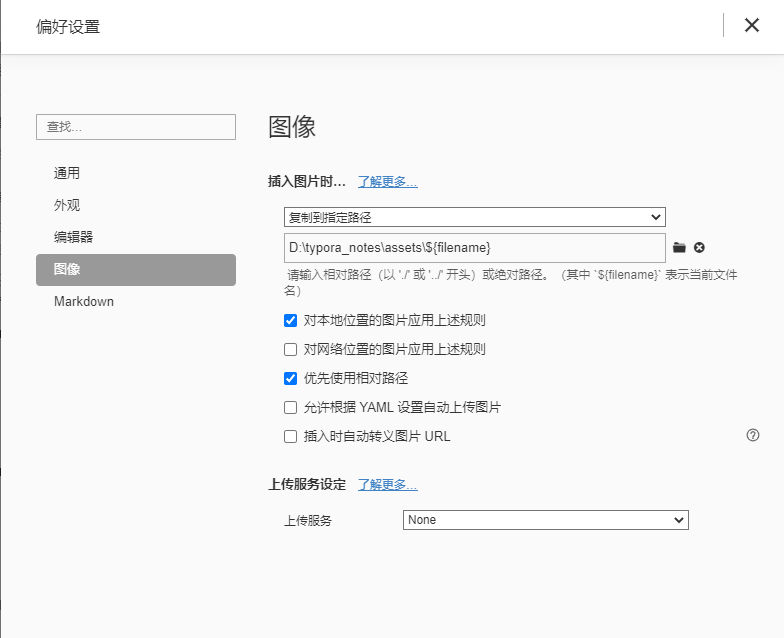
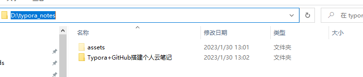
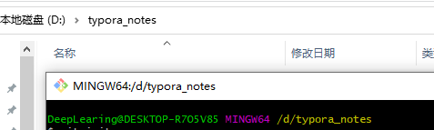
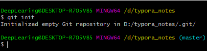

# Typora+GitHub搭建个人云笔记

## 一、必备工具

​	1.typora

​	2.git

## 二、typora设置

​	1.点击菜单栏中的文件下的偏好设置。在图像设置页面选择复制到指定路径，并且勾选优先使用相对路径。

​	2.新建一个文件夹用来存放笔记，在该目录下新建一个assets文件夹用来存放文档中的图片。并且将assets设置为隐藏，这样typora就不会找到这个文件夹。

## 三、GitHub设置

​	1.首先创建一个本地的版本库，即文件夹 (我这里在 D盘根目录创建了名为typora_notes的文件夹)，进入该文件夹打开Git Bash Here

2.通过命令git init把这个文件夹变成Git可管理的仓库，这时目录下多了个.git文件夹，它是Git用来跟踪和管理版本库的。

