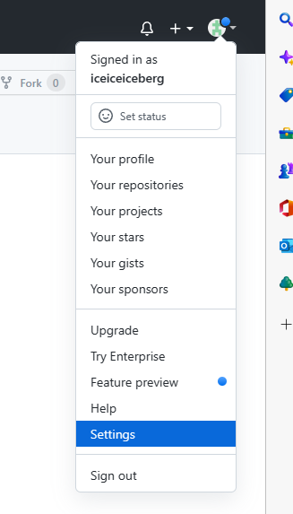

# Typora+GitHub搭建个人云笔记

## 一、必备工具

1.安装typora：[learningNotebook/installer at master · iceiceiceberg/learningNotebook (github.com)](https://github.com/iceiceiceberg/learningNotebook/tree/master/installer)

2.安装git：[Git (git-scm.com)](https://git-scm.com/)

​	Windows用户下载下载windows版本后，一路点击下一步安装完成。

## 二、typora设置

1.点击菜单栏中的文件下的偏好设置。在图像设置页面选择复制到指定路径，并且勾选优先使用相对路径。


2.新建一个文件夹用来存放笔记，在该目录下新建一个assets文件夹用来存放文档中的图片。并且将assets设置为隐藏，这样typora就不会找到这个文件夹。


## 三、配置Git

### 1.配置用户名和邮箱

初次安装git需要配置用户名和邮箱，在电脑上运行Git Bash


运行命令

```
$ git config --global user.name "你自己的用户名"
$ git config --global user.email "你自己的邮箱"
```

这里的用户名和邮箱是git提交时用来显示你身份和联系方式的，并不是github用户名和邮箱

### 2.配置自己的SSH密钥

简单说一下什么是ssh密钥，ssh密钥分为公钥和私钥，每个用户都必须提供一个公钥用于授权，当该用户发送文件时，用私钥签名，而别人就需要他给的公钥解密。

初次使用都要生成自己的钥匙，并添加到自己的github上。

打开GitBash，使用指令

```
$ ssh-keygen -t rsa -C {你的邮箱}
```

可以打开C盘目录->User(用户)->XXX->.ssh文件里面查看，pub后缀的就是公钥，没有则为私钥。

打开pub文件，可用文本工具打开，全选复制我们刚刚生成的密钥。

打开Github，找到setting，找到SSH设置选项，新建，粘贴，起名，确定。



点击SSH and GPG keys。


点击New SSH key。


title可以任意取名，然后在key文本框中粘贴从.pub文件中复制的公钥。随后点击Add SSH key。


## 四、创建GitHub远程仓库


其他统一不需要勾选直接创建就可以了。创建成功后找到仓库对应的https地址，点击复制。


## 五、上传文件到远程仓库

1.首先创建一个本地的版本库，即文件夹 (我这里在 D盘根目录创建了名为typora_notes的文件夹)，进入该文件夹打开Git Bash Here


2.通过命令git init把这个文件夹变成Git可管理的仓库，这时目录下多了个.git文件夹，它是Git用来跟踪和管理版本库的。


3.把想要上传到github上的文件目录粘到这个本地Git仓库里面。


4.使用 git add . 将目录下所有文件添加到暂存区（注意点是用空格隔开的）。


5.用git commit 命令将暂存区内容添加到本地仓库中。

```
git commit -m [message]
```

[message] 可以是一些备注信息。

（前面配置过git的话可以跳过此步）开始前我们需要先设置提交的用户信息，包括用户名和邮箱：

```
$ git config --global user.name 'runoob'
$ git config --global user.email test@runoob.com
```

6.在Github上创建好Git仓库之后就可以和本地仓库进行关联了，在本地仓库的命令行输入

```
git remote add origin [仓库地址]
```

仓库地址是我们之前在“创建GitHub远程仓库”时复制的https地址


7.关联好之后我们就可以把本地库的所有内容推送到远程仓库了，输入指令

```
$ git push -u origin master
```

按照提示输入用户名和密码


新建的远程仓库是空的，所以要加上 **-u** 这个参数。

等远程仓库里面有了内容之后，下次再从本地库上传内容的时候就不用加 -u 了