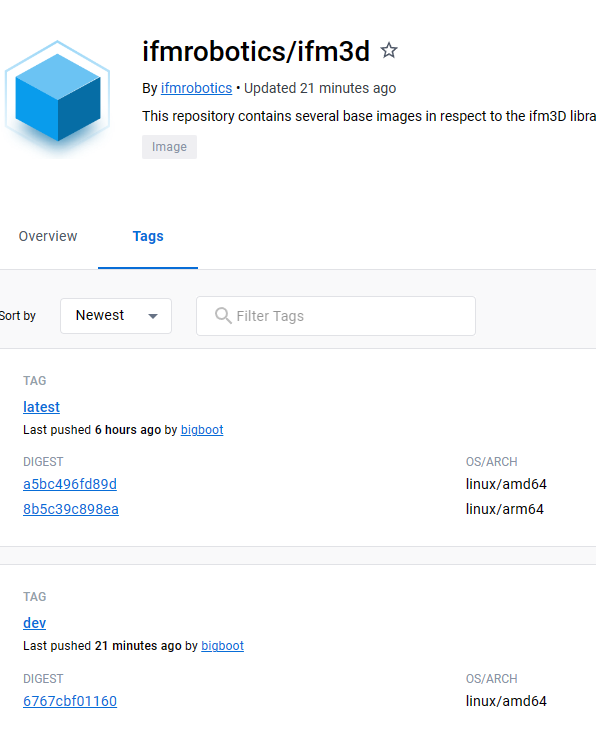
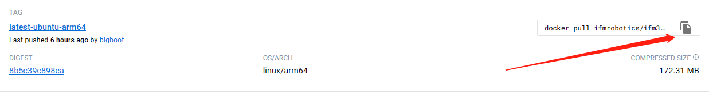
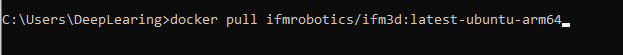
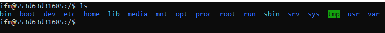
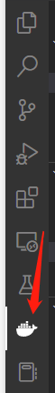
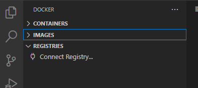
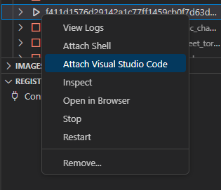

# Windows平台基于vscode+docker搭建关于IFM O3R平台的C++开发环境

## 1.获取搭载有ifm3d库的Ubuntu的docker镜像（参考：[为 O3R 平台构建并运行 docker 容器 — O3R 文档 (ifm3d.com)](https://ifm3d.com/documentation/Docker/docker.html)）

官方的基础镜像已经构建了包含python3以及o3r平台开发需要的ifm3d库，因此我们将基于该镜像搭建基于c/c++的开发环境。

首先在docker hub中查看ifm发布的镜像

打开[ifmrobotics/ifm3d Tags | Docker Hub](https://hub.docker.com/r/ifmrobotics/ifm3d/tags)



切换到Tags页面选择需要的镜像，本文以latest-ubuntu-arm64版本为例。该镜像是基于linux/arm64的。点击复制docker pull命令。



然后在Windows控制台粘贴。



按下enter后等待docker pull完成，完成后Docker Desktop可以查看到该镜像：


接着在控制台中输入命令运行该镜像：

```
docker run -it [镜像名]
```

其中[镜像名]为你需要运行的镜像名，点击复制，如下图所示：


这时将以交互模式进入到该镜像生成的容器，ls命令可以查看文件：



## 2.配置vscode（参考:[几乎无痛的VSCode+clangd+lldb+cmake配置C/C++开发环境指南 - 知乎 (zhihu.com)](https://zhuanlan.zhihu.com/p/566365173)）

### 2.1 安装docker插件

在vscode插件页面搜索docker后点击install，再搜索Dev Containers，同样点击install。完成之后打开vscode就能找到docker页面。



### 2.2 通过remote插件进入docker容器

点击鲸鱼图标就能进入docker管理界面



点击containers可以看到在第一步中运行的容器


右键选择正在运行的容器，选择Attach Visual Studio Code



之后打开新的窗口即可对该容器进行操作。

### 2.3 配置VSCode+clangd+lldb+cmake配置C/C++开发环境

接下来的步骤直接参考该篇文章：[几乎无痛的VSCode+clangd+lldb+cmake配置C/C++开发环境指南 - 知乎 (zhihu.com)](https://zhuanlan.zhihu.com/p/566365173)

利用remote插件配合docker可以搭建出一个丝滑般体验的开发环境。

